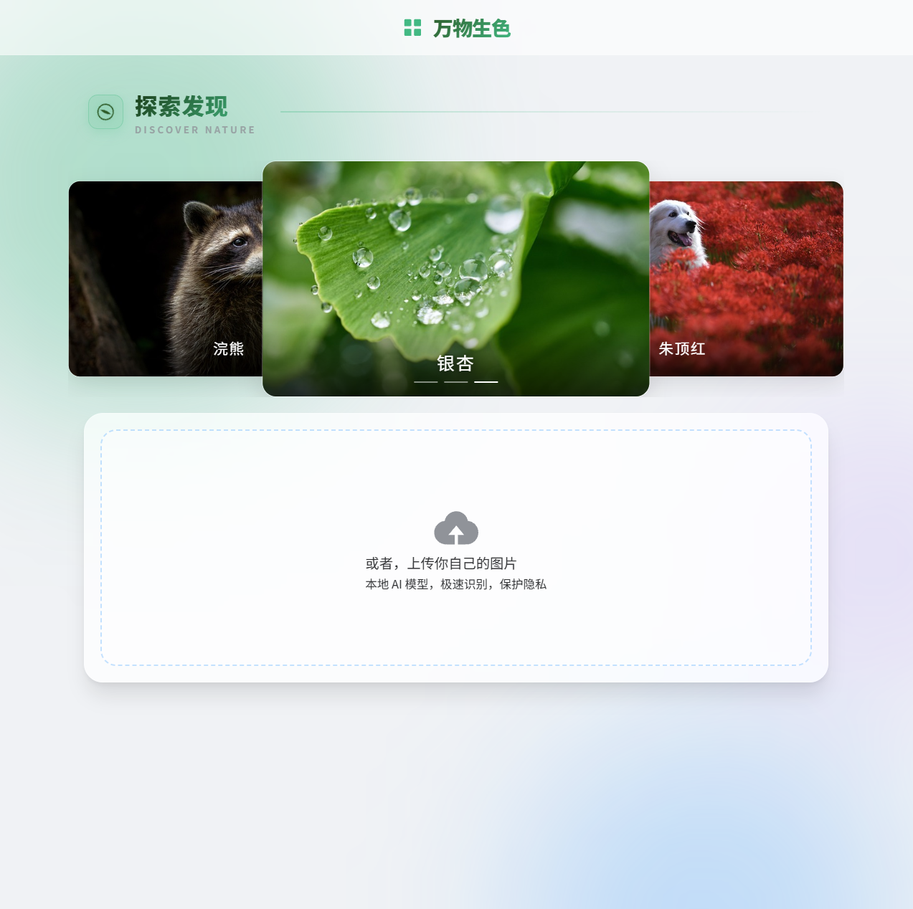
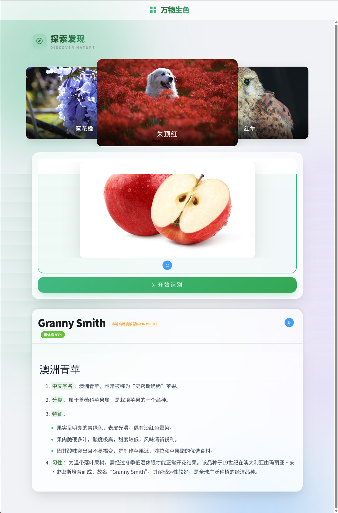

# 🌳 万物生色 (Smart Nature Identifier)

> 基于 Vue 3 + Flask + ResNet-101 + DeepSeek 大模型的动植物智能识别与科普系统。
> 本项目由Gemini辅助开发。




---

### ✨ 功能特性

- **🚀 混合识别引擎 (Hybrid Recognition Engine)**
  - **本地推理**: 采用 **ResNet-101** 高精度模型，通过 **PyTorch + CUDA** 在本地 GPU (已在 RTX 5070 上验证) 上实现毫秒级推理，保护用户隐私。
  - **云端增强**: 当本地模型置信度低于 60% 时，自动调用 **百度 AI** 云服务进行二次识别，确保识别准确率。

- **🧠 深度科普 (AI-Generated Encyclopedia)**
  - 集成 **DeepSeek/火山引擎大语言模型**，根据识别结果实时生成生动、准确的物种科普介绍。

- **🎙️ 多模态交互 (Multimodal Interaction)**
  - **流式语音**: 采用 **微软 Edge-TTS** 神经网络语音，实现文字“边生成边朗读”的流式语音体验，声音自然流畅。
  - **智能滚动**: 页面可根据文字生成速度自动平滑滚动，提供沉浸式阅读体验。

- **🌍 探索发现 (Discovery Module)**
  - 集成 **Pixabay** 高清图库，通过大模型随机推荐自然界的神奇生物，并展示高清实拍图。

- **🎨 极致 UI/UX (Modern UI/UX)**
  - 采用 **Vue 3 + Element Plus** 打造，整体设计为 **玻璃拟态 (Glassmorphism)** 风格，配合 **动态极光背景**，视觉效果酷炫。
  - 全站响应式布局，完美适配 PC、平板和手机。

---

### 🛠️ 技术栈

|    分类      | 技术                                                                  |
| :---------   | :-------------------------------------------------------------------- |
| **前端**     | `Vue 3`, `TypeScript`, `Vite`, `Pinia`, `Element Plus`, `SCSS`, `Axios`      |
| **后端**     | `Python 3.9+`, `Flask`                                                |
| **AI 推理**  | `PyTorch 2.x (CUDA)`, `ResNet-101 (TorchVision)`                      |
| **语音合成** | `Edge-TTS`                                                            |
| **第三方服务** | `DeepSeek LLM API`, `Baidu AI Vision API`, `Pixabay Image API`          |

---

### 🚀 快速开始

#### 1. 克隆项目
```bash
git clone https://github.com/Zbi-i/smart-nature-identifier.git
cd smart-nature-identifier
```

### 2. 启动前端 (/)
```bash
# 安装依赖
npm install

# 复制环境变量模板并填入 Key
cp .env.example .env

# 启动开发服务器
npm run dev
```

### 3. 启动后端 (/backend_python)
确保已安装 Python 3.9+ 和 NVIDIA CUDA 环境 (推荐)。
```bash
cd backend_python

# 建议创建并激活虚拟环境
python -m venv venv
# Windows: .\venv\Scripts\activate  |  Mac/Linux: source venv/bin/activate

# 安装依赖
pip install -r requirements.txt

# 复制环境变量模板并填入 Key
cp .env.example .env

# 启动服务 (首次运行会自动下载 ResNet-101 模型)
python app.py
```

### 🌟 后续更新计划 (Roadmap)
[计划中] 📸 识别历史记录 (Identification History)
功能: 将用户的每一次成功识别（包括图片、结果、科普文字）保存在浏览器的 LocalStorage 中。
实现: 新增一个“历史”页面或侧边栏，以时间线的形式展示历史记录，点击即可回顾详情。
技术: Vue Router 页面路由, LocalStorage 本地持久化, Pinia 状态管理。
[探索中] 🗺️ 地理位置标记 (Geolocation Tagging)
功能: 在上传图片时，可选附带当前地理位置。后台可以分析“用户在什么地方发现了什么物种”。
技术: 浏览器 Geolocation API, 后端可对接地图服务（如高德地图）。
[探索中] 🌐 模型微调 (Model Fine-tuning)
功能: 针对特定物种（如“本地常见鸟类”）进行模型微调，进一步提升垂直领域的识别精度。
技术: PyTorch Transfer Learning, LabelImg 数据标注。
[探索中] 💬 连续对话 (Conversational AI)
功能: 在生成科普后，允许用户基于当前物种进行追问，如“它吃什么？”或“它和狮子有什么区别？”。
技术: LLM API 的多轮对话管理。