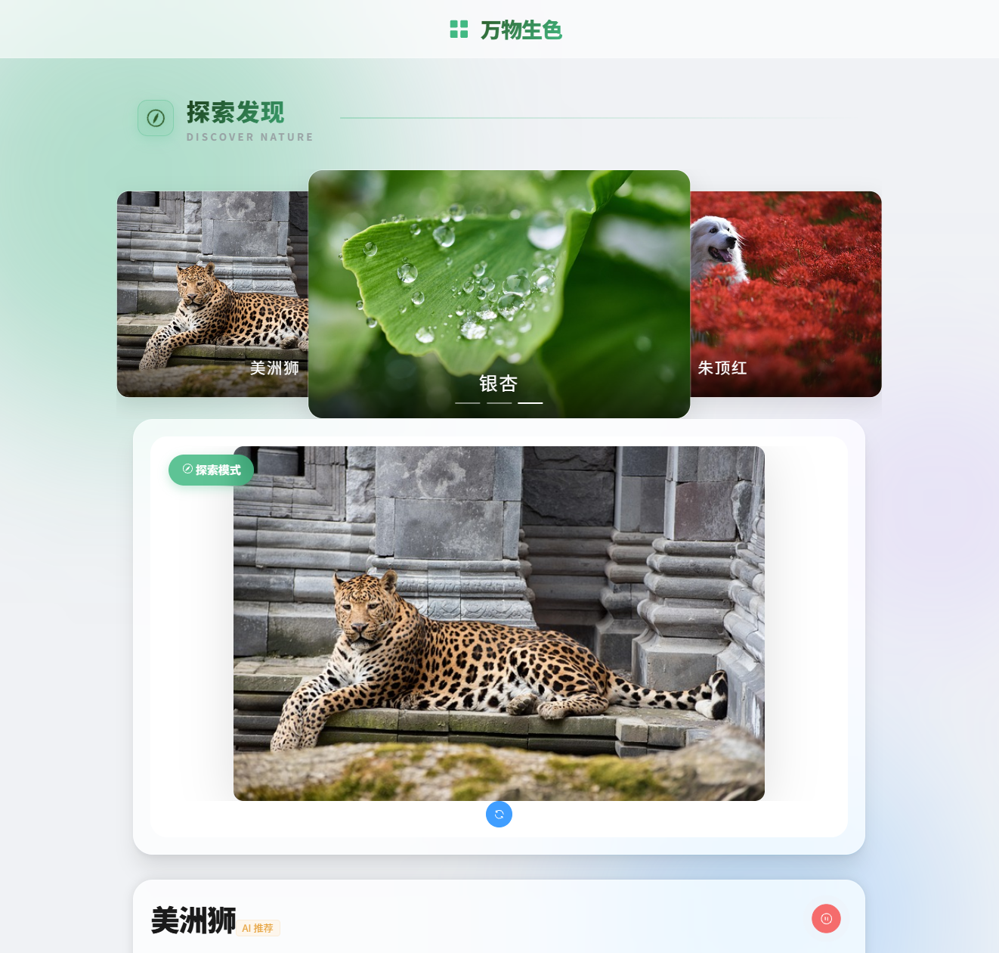

# 🌱 智物识踪 (Smart Plant & Animal Identifier)

> 基于 Vue 3 + Flask + ResNet-101 + DeepSeek 大模型的动植物智能识别与科普系统。

![项目截图]



## ✨ 功能特性

- **混合识别引擎**：本地 ResNet-101 高精度模型（GPU 加速）+ 百度 AI 云端增强识别，自动根据置信度切换，准确率与隐私兼顾。
- **深度科普**：集成 DeepSeek/火山引擎大语言模型，实时生成生动有趣的物种科普介绍。
- **多模态交互**：支持微软 Edge-TTS 语音合成，实现“边生成边朗读”的流式语音体验。
- **探索发现**：集成 Pixabay 高清图库与 DuckDuckGo 搜索，随机推荐自然界的神奇生物。
- **极致 UI**：采用 Element Plus + 玻璃拟态设计，支持响应式布局与极光流光背景。

## 🛠️ 技术栈

- **前端**：Vue 3, TypeScript, Vite, Element Plus, SCSS, Axios
- **后端**：Python Flask, PyTorch (CUDA), Edge-TTS, DuckDuckGo Search
- **AI 模型**：ResNet-101 (TorchVision), DeepSeek-V3.2

## 🚀 快速开始

### 1. 克隆项目
```bash
git clone https://github.com/Zbi-i/smart-nature-identifier
cd smart-nature-identifier
```

### 2. 前端启动

```bash
npm install
# 复制 .env.example 为 .env 并填入 Key
cp .env.example .env
npm run dev
```

### 3. 后端启动

确保已安装 Python 3.9+ 和 CUDA 环境（推荐）。

```bash
cd backend_python
# 建议创建虚拟环境
python -m venv venv
# Windows 激活虚拟环境
.\venv\Scripts\activate

# 安装依赖
pip install -r requirements.txt
# 如果需要 GPU 加速，请根据显卡版本单独安装 PyTorch (参考 PyTorch 官网)

# 复制 .env.example 为 .env 并填入 Key
cp .env.example .env

# 启动服务
python app.py
```